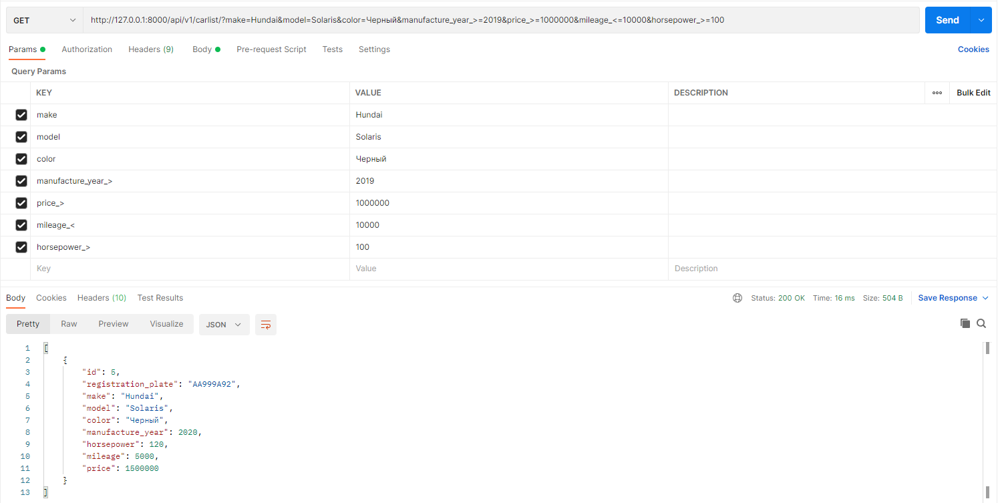

<h2>Тестовое задание “Справочник автомобилей”</h2>
Архитектура API - REST. 
Выполнено на Python с помощью фреймворков Django и DRF. 
Хранимая информация об автомобилях: 
<ul>
  <li>номер,</li>
  <li>марка,</li>
  <li>модель,</li>
  <li>цвет,</li>
  <li>год выпуска,</li>
  <li>количество лошадиных сил,</li>
  <li>пробег в километрах,</li>
  <li>цена, рублях.</li>
</ul>
<h3>Описание API</h3>
<table>
    <tr>
        <th>Действие</th>
        <th>URL</th>
        <th>Метод</th>
        <th>Параметры</th>
        <th>Возвращаемый результат</th>
    </tr>
    <tr>
        <td>Вывод списка автомобилей</td>
        <td>http://127.0.0.1:8000/api/v1/carlist</td>
        <td>GET</td>
        <td>Нет параметров или параметры для фильтрации (Приложение 1)</td>
        <td>Список автомобилей </td>
    </tr>
    <tr>
        <td>Добавление автомобиля</td>
        <td>http://127.0.0.1:8000/api/v1/carlist</td>
        <td>POST</td>
        <td>Json с параметрами объекта</td>
        <td>Результат операции (успех JSON с параметрами объекта, ошибка, объект уже существует)</td>
    </tr>
    <tr>
        <td>Удаление автомобиля</td>
        <td>http://127.0.0.1:8000/api/v1/carlist/ID Где ID идентификатор автомобиля</td>
        <td>DELETE</td>
        <td>Нет параметров</td>
        <td>Результат операции (успех, ошибка, объект не найден)</td>
    </tr>
    <tr>
        <td>Редактирование автомобиля </td>
        <td>http://127.0.0.1:8000/api/v1/carlist/ID Где ID идентификатор автомобиля</td>
        <td>PUT</td>
        <td>Нет параметров</td>
        <td>Результат операции (успех JSON с параметрами объекта, ошибка, объект не найден)</td>
    </tr>
    <tr>
        <td>Вывод статистики базы автомобилей</td>
        <td>http://127.0.0.1:8000/api/v1/cardbstatisticslist/</td>
        <td>GET</td>
        <td>Нет параметров</td>
        <td>Список событий базы автомобилей</td>
    </tr>
</table>
<h3>Приложение 1</h3>
<h4>Параметры для фильтрации автомобилей</h4>
<table>
    <tr>
        <th>Параметр</th>
        <th>Назначение</th>
    </tr>
    <tr>
        <td>registration_plate</td>
        <td>Указывает номер автомобиля</td>
    </tr>
    <tr>
        <td>make</td>
        <td>Указывает марку автомобилей</td>
    </tr>
    <tr>
        <td>model</td>
        <td>Указывает модель автомобилей</td>
    </tr>
    <tr>
        <td>color</td>
        <td>Указывает цвет автомобилей</td>
    </tr>
    <tr>
        <td>manufacture_year</td>
        <td>Указывает год выпуска автомобилей</td>
    </tr>
    <tr>
        <td>horsepower</td>
        <td>Указывает количество лошадиных сил автомобилей</td>
    </tr>
    <tr>
        <td>mileage</td>
        <td>Указывает пробег автомобилей</td>
    </tr>
    <tr>
        <td>price</td>
        <td>Указывает цену автомобилей</td>
    </tr>
</table>

<h3>Примечание</h3>
У параметров manufacture_year, horsepower, mileage, price могут быть постфиксы "_>" и "_<", что будет означать больше или меньше соответственно.
<h4>Пример</h4>
